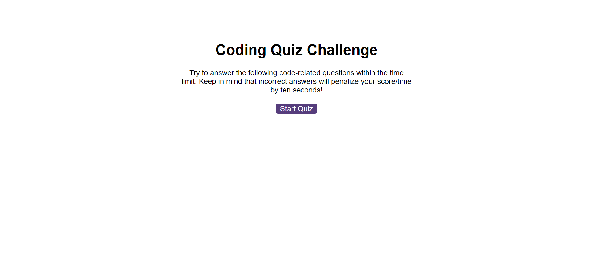

# Coding-Quiz (Challenge: Week 6)

## Description
This is a coding quiz for web developers with questions covering different aspects of HTML and JavaScript. The JavaScript component of the code is used to interact dynamically with both HTML and CSS files. In particular, this employs 'querySelector' to interact with elements in HTML, 'addEventLister' to activate buttons and 'setAttribute' to manipulate style in CSS. Elements are created and appended which contain text for questions and multiple choice answers; and indexing is employed to determine the answers chosen by the user. Several timers run using the setInterval() method both to operate the game and to display messages to the user. Finally, 'localStorage' retains the user's initials and score at game's end and these are displayed on a separate highscores webpage. On the highscores page, initials and scores are stored as an array of objects using JSON.stringify() and retrieved using JSON.parse().

## Installation
N/A

## Usage
N/A

## Credits
N/A

## License
N/A

## https://davidbluelamassu.github.io/Coding-Quiz/

